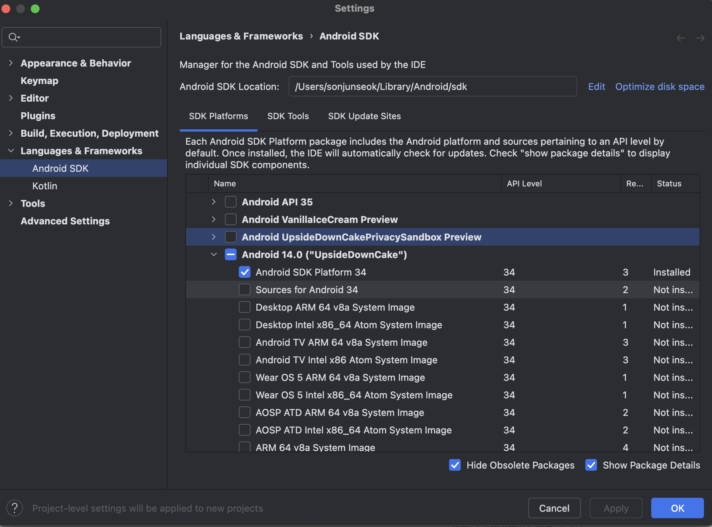
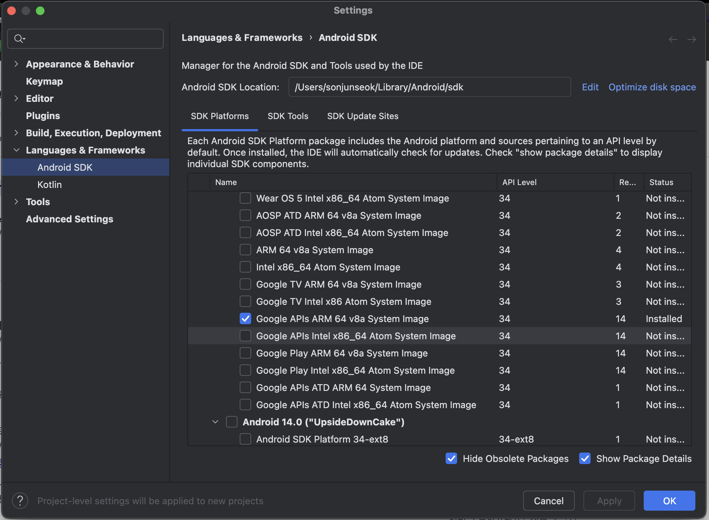
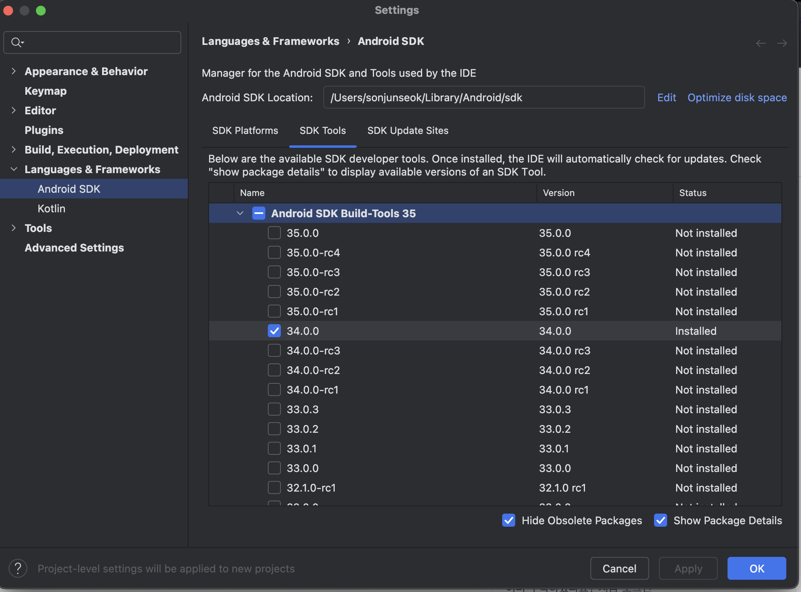

<image  src="readme/appstore.png" style="height: 120px; width: 120px"/>

# Game Link

### 함께 LoL(League of Legends)를 플레이할 친구를 구하세요!

회원가입 후 함께 게임하길 원하는 유저를 찾아서 대화를 시작하세요! 원하는 포지션, 티어, 게임 종류를 조정하여 LoL 플레이 유형이 맞는 유저와 함께 소통하고 게임을 시작할 수 있습니다. 간단한 사용 챔피언 정보, 게임 전적 정보를 확인하고 함께 게임을 시작하세요.

### 기술 스택

<code>react Native</code>, <code>Typescript</code>, <code>Eslint</code>, <code>Yarn</code>, <code>React-Hook-Form</code> , <code>Zod</code> , <code>Zustand</code> , <code>React Navigation</code>, <code>Websocket</code>, <code>Stomp</code>, <code>Sentry</code> , <code>Notifee</code>, <code>Axios</code>, <code>Tanstck Query</code>,
<code>Firebase</code>

### 주요 기능 정리

- Oauth를 활용한 로그인
- Riot Api를 활용한 계정 전적 정보 소개
- websocket, stomp를 활용한 채팅방 기능
- firebase, notifee를 활용한 app push notification 구현

### Architecture

### 기본 SETTING

기본 세팅 확인하기

- node가 설치되고 전역환경에서 접근할 수 있어야 합니다.
- ios 세팅은 다음과 같이 진행을 합니다. [링크](https://reactnative.dev/docs/set-up-your-environment)
- android 설정은 다음과 같이 진행을 합니다.

- 우선 android studio를 설치합니다. [링크](https://developer.android.com/studio?hl=ko&_gl=1*1jxywkb*_up*MQ..*_ga*MTczNTY4MDUyNi4xNzI2NTU2ODA3*_ga_6HH9YJMN9M*MTcyNjU1NjgwNy4xLjAuMTcyNjU1NjgxOC4wLjAuMjA2MjE5MjQzMA..)
- 공식문서의 ios android 설정을 참고 합니다. [링크](https://reactnative.dev/docs/set-up-your-environment?platform=android) android studio가 설치가 되었다면 다음과 같은 설정이 필요합니다.
  

  

  

이후 공식문서에서 요구하는 모든 설정을 진행하시면 되겠습니다.

### 1. 라이브러리 설치하기

- yarn 커맨드를 입력해서 필요로 하는 라이브러리를 모두 설치합니다.
- ios 폴더로 이동을 합니다. `cd ios` 이후 `pod install`을 실행합니다.

### 2. 시작하기

- android : yarn start 명령어 입력 이후 a 클릭 혹은 yarn android
- ios : yarn start 명령어 입력 이후 i 클릭 혹은 yarn ios

